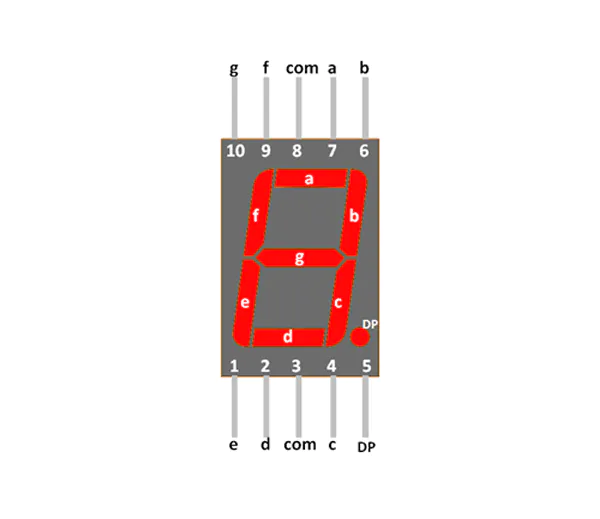
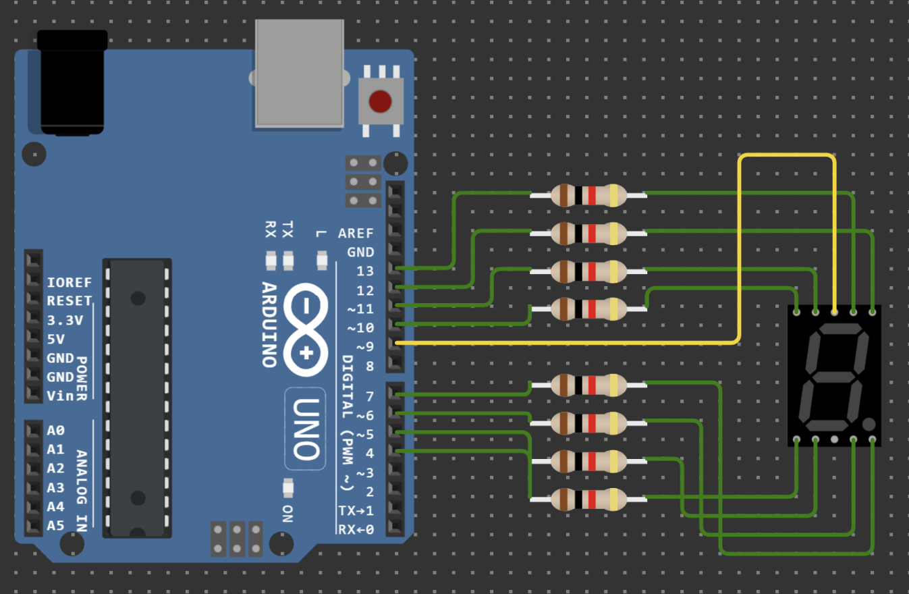

# KYSevenSegment 
### Written by KYLiN

---

This is a code using Arduino for control seven segment 

---
## Download 

### Code 
you can click the code to download zip 

### Git 
you can use this command to download

`git clone https://github.com/KeithLin724/KYSevenSegment`

---
## About 
> Note: The hex code need right to left to print 

Here inside have a [Easy-HexCodeGenerator](/HexCodeGenerator) only one file for make seven-segment code 

> ! Recommend use [HexCodeGenerator](https://github.com/KeithLin724/HexCodeGenerator)

---
## How to use


flow the segment pins to connect and then coding 

### 2 Ways to construct 

```c++
KYSevenSegment(uint16_t pins[8], bool inv_mode = false);

KYSevenSegment(int a, int b, int c, int d, int e, int f, int g,int dp, bool inv_mode = false);
```

### 2 Way to set Mode and Pins
```c++
void setInvMode(const bool& inv_mode);

void setPins(uint16_t pins[8]);
```

### Getting Mode function 

```c++
bool getMode() const;
```

### Display Function
```c++
// Display Number 
void displayNumber(const uint16_t& id, const bool& dp = false) const;

// Display using Hex code (you can use easy-HexCodeGenerator)
void displayHex(const byte& value, const bool& dp = false) const;

// Only control DP function 
void onlyControlDP(const bool& dp = false) const;

// clear display function 
void clearDisplay() const;
```

## Example 
> Example connect 
